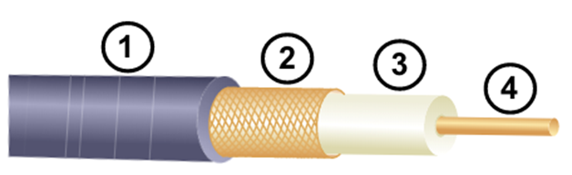
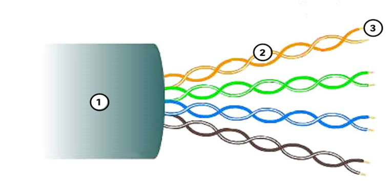
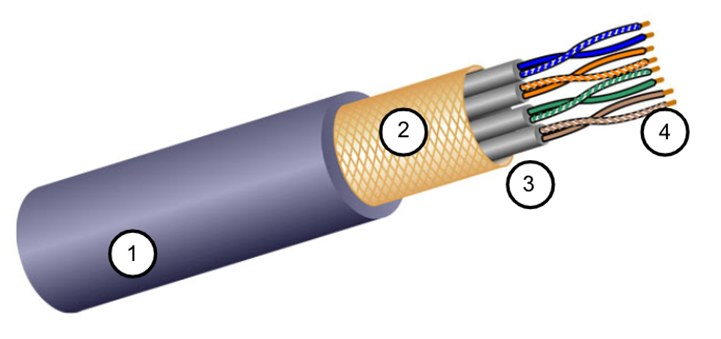
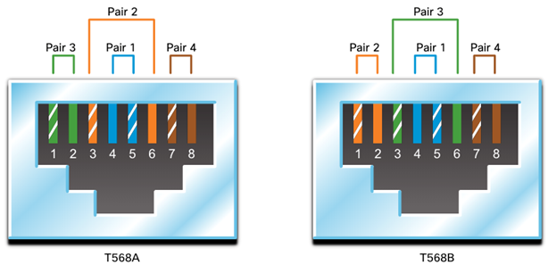
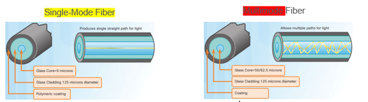

# Otázka č. 6 - Fyzická vrstva

> Význam vrstvy, přenos dat – PDU, signál symetrický/asymetrický, pásmo základní/přeložené, strukturovaná kabeláž

>1) vrstvy ISO/OSI modelu - pouze seřazeně vypsat :)
>2) význam vrstvy a její úkoly, která zařízení pracují na této vrstvě?
>3) přenosová média - rozdělení a jejich popis - rozepiš se (výhody, nevýhody, vlastnosti,
   vzdálenosti, kategorie…)
>4) vysvětli pojmy - duplex, IEEE 802.3, IEEE 802.11, šířka pásma, propustnost
>5) co můžeme říct o kabelu s označením 1000BASE-T a 100BASE-LX10

## 1. Význam

- Nejnižší vrstva v modelu ISO/OSI
- Zajišťuje přenos bitů po komunikačním kanálu, pomocí elektrických, optických nebo bezdrátových signálů
- mechanismy pro detekci chyb v přenesených datech
- Určuje rychlost přenosu a šířku pásma
- Definuje fyzické vlastnosti přenosového média
- Zajištujě synchronizaci mezi vysílačem a přijímačem

## 2. Přenos dat

- bity (0,1)
- Změna napětí nebo světelného signálu 
- Přenosové médium (kabel, optické vlákno, bezdrátově)
- Přenosová rychlost (bit/s)
- Příklad: 101011010110010110

## 3. Signály 

### Symetrický 

-  změna napětí nebo amplitudy signálu při přechodu z jednoho stavu na druhý je stejná jako při přechodu z druhého stavu zpět
- diferenciální signálové páry (Ethernet, USB)

### Asymetrický

- Změna z jednoho stavu na druhý může být odlišná od změny z druhého stavu zpět.
- Jednoduchý sériový signál 

## 4. Pásma

### Základní

- frekvenční složka blízko nule
- digitalní signal (přenos dat přes vodiče)
- nejsou modulovány na vyšší frekvence

### Přeložené

- modulovány nebo posunuty na vyšší frekvence
- použito pro bezdrátovou komunikaci
- může obsahovat více různých frekvencí 

## 5. Strukturovaná kabeláž

- obecné označení metalických a optických prvků, které umožňují propojení jednotlivých uživatelů v rámci počítačové sítě.

#### Telekomunikační zásuvky

- připojení koncových uživatelských zařízení
- dvouproudové provedení
    - připojení počítače, notebooku
    - připojení telefonu

#### Patch panel

- umístěny v rozvaděčích v telekomunikační místnosti
- slouží správci sítě k připojení jednotlivých uživatelů do aktivních zařízení (switch)

#### Horizontální kabely

-  čtyři kroucené páry
-  propojují telekomunikační zásuvky a patch panely.

#### Patch kabely

- připojení uživatelských zařízení do počítačové sítě na straně telekomunikačních zásuvek a připojení jednotlivých portů patch panelů do aktivních zařízení na straně rozvaděče.

#### kategorie podle výkonnosti 

- Cat 3. (10 Mbit/s)
- Cat 5. (100 Mbit/s)
- Cat 5e. (1 Gbit/s)
    - šířka pásma 100 MHz
- Cat 6. (1 Gbit/s)
    - šířka pásma 250 MHz
- Cat 6a. (10 Gbit/s)
    - šířka pásma 500 MHz
- Cat 7. (10 Gbit/s)
    - šířka pásma 600 MHz
- Cat 7a. (10 Gbit/s)
    - šířka pásma 1000 MHz
- Cat 8. (25/40 Gbit/s)
    - šířka pásma 2000 MHz

# Typy kabelů

## CC (Copper cabling)
- metalické kabely
- čím delší, tím větší útlum
- signál je citlivý na rušení

## Koaxiální kabel
- vrstvy
  - vnější plášť
  - měděné opletení -> druhý vodič a jako šťít pro vnitřní vodič
  - plastová izolace
  - měděný vodič
  

## UTP
- Unshielded Twisted Pair
- nejčastěji zakončeno koncovkou RJ-45
- 4 páry kroucených vodičů
- vrstvy
  - vnější plášť
  - zakroucené páry
  - plastová izolace
  - měděný vodič
- zakroucením do párů se snižuje rušení (obrácená polarita vodičů v páru)
- každý vodič má svou barvu

## STP
- Shielded Twisted Pair
- jedná se o UTP s kroucenými páry, které jsou navíc obaleny kovovým pláštěm
- poskytuje lepší ochranu proti rušení
- těžší instalace kvůli uzemnění kovového pláště
- vrstvy
  - vnější plášť
  - kovový plášť
  - foliový štít pro každý pár
  - plastová izolace
  - měděný vodič

## RJ45

## Optické kabely
- o hodně dražší než metalické
- vysoká rychlost přenosu
- nízký útlum
- nízká citlivost na rušení
  - vysoká odolnost proti elektromagnetickým vlivům
- větší přenosová vzdálenost
- větší šířka pásma
- využívá buď laser (pro delší) vzdálenosti) nebo LED (pro kratší vzdálenosti) - rozdíl je v ceně

### Single-mode vs Multi-mode

- single-mode
  - menší průměr jádra
  - laserový zdroj
  - větší přenosová vzdálenost
  - dražší
- multi-mode
  - větší průměr jádra
  - LED zdroj
  - kratší přenosová vzdálenost
  - levnější

# Pojmy
## duplex
- režim komunikace
- jakým způsobem dokáží dvě zařízení komunikavat v jeden okamžik
- full-duplex
  - obě zařízení mohou komunikovat současně
  - obě zařízení mohou posílat a přijímat data
- half-duplex
  - obě zařízení nemohou komunikovat současně
  - obě zařízení mohou posílat nebo přijímat data

## IEEE 802.3
- Ethernet
- drátová komunikace

## IEEE 802.11 
- Wi-Fi
- bezdrátová komunikace
- různé standardy - liší se rychlostí, spolehlivostí a přenosovou kapacitou
- 
## šířka pásma
- kapacita přenosového média
- množství dat, která mohou v daném časovém okamžiku být přenesena (kolik bitů lze přenést za sekundu)

## propustnost
- rychlost přenosu dat
- Rychlost, jakou se bity přenášejí přes médium za dané časové období

# co můžeme říct o kabelu s označením 1000BASE-T a 100BASE-LX10

## 1000BASE-T
- 1000BASE = Gigabit Ethernet
- T = Twisted Pair

- Gigabit Ethernet
- UTP kabely
- 1000 Mbit/s

## 100BASE-LX10
- 100BASE = Fast Ethernet
- LX = Long-wavelength (multimode optické vlákno)
- 10 = 10 km

- Fast Ethernet
- 100 Mbit/s
- optické kabely