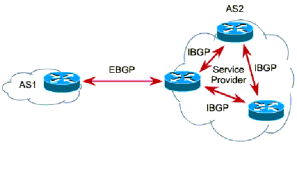

# Otázka č. 23 - WAN

> Základní pojmy, sériová/paralelní komunikace, WAN technologie, širokopásmové připojení, VPN, BGP

>1) Význam WAN sítí
>2) Základní technologie WAN - možnosti připojení: Point-to-Point, Frame Relay…
>3) Sériová a paralelní komunikace
>4) Vysvětli pojmy: VPN, BGP, DSL

# Význam WAN

- Wide Area Network (WAN) je síť, která pokrývá rozlehlé geografické území (například síť, která překračuje hranice města, regionu nebo státu)
- WAN sítě jsou využívány pro propojení LAN sítí nebo dalších typů sítí
- Umožňuje tedy komunikace uživatelů z dvou vzdálených míst
- ISO/OSI model pro WAN je omezen jen na fyzickou a linkovou vrstvu
  - Fyzická vrstva – stará se o doručovací metody (ADSL, ATM, Frame Relay atd.)
  - Linková vrstva – stará se o zapouzdření a adresaci

# Připojení k WAN

## Point-to-Point

- Jde o pronajatou, nebo soukroumou linku mezi dvěma body, která je využívána pouze pro komunikaci mezi těmito dvěma body. Tato služba je velice drahá´, ale bezpečná a většinou nejspolehlivější cesta

- Využívá stejnojmenný protokol
- velmi jednoduché přístupové metody
- Half/full duplex

## Frame Relay

- Protokol pro přenos a přepínání wan packetů
- nízká chybovost a nízká latence

# Seriová vs Paralelní komunikace

## Seriová komunikace
- přenos informací po jednom bitu po jednom vodiči
- používá se na dálkové přenosy, kde je výsoká cena vícevodičový kabel nebo kde jsou potíže se synchronizací
- na kratší vzdálenosti se také používá čím dál tím častěji kvůli problémům parazitních signálů
- ethernet, USB, PCI-Express

## Paralelní komunikace
- přenos informací po více bitech po více vodičích
- rychlejší než seriová komunikace
- problémem byla synchronizace signálů a problémy při delších vzdálenostech (zpožění způsobuje nečitelnost signálu)
- ATA, PCI

# Pojmy

## VPN
- VPN vytváří prostředí, které mohou uživatelé považovat za své vlastní – mohou o něm i rozhodovat – o jeho vlastnostech, parametrech, nastavení, zabezpečení apod.
- Také mohou rozhodovat, jestli do něj pustí jiné uživatele a za jakých podmínek
- Privátní prostředí VPN není skutečné, ale jen virtuální
- Poskytuje větší zabezpečení, při navazování spojení vyžaduje totožnost obou stran ověřit pomocí digitálních certifikátů atd.
- Veškerá komunikace je šifrovaná
- Při vytváření sítě nemusí budovat žádnou přenosovou infrastrukturu
- Př: Ve firmě se zprovozní VPN server, to umožní mít bezpečnou a šifrovanou firemní komunikaci a pro připojení odkudkoli z Internetu, do firemního intranetu (vnitřní sítě) se mohou daní VPN klienti připojit. VPN server tvoří funkci síťové brány, která zprostředkovává připojení, šifrování, bezpečnost a připojení do dané sítě.

## BGP

- routovací protokol
- Border Gateway Protocol
- používá se pro směrování mezi autonomními systémy
- na pomezí link-state a path-vector protokolů
- Vazba mezi BGP routery různých AS nazýváme externí BGP (eBGP)
- Vazbu mezi BGP routery ve stejném AS nazýváme interní BP (iBGP)

## DSL
- technologie umožňující přenos dat po telefonní nebo televizní lince, bez ztráty kvality hovoru nebo obrazu
- DSL je zkratka pro Digital Subscriber Line
- využití plochých nekroucených kabelů nebo i koaxiálních kabelů
- na obou stranách musí být DSL modem, který přenos zajišťuje
- využívají jiné frekvence než telefonní hovory, tím pádem je možné telefonovat zároveň s posíláním dat