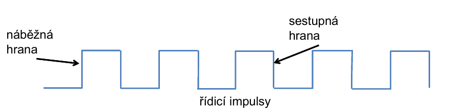
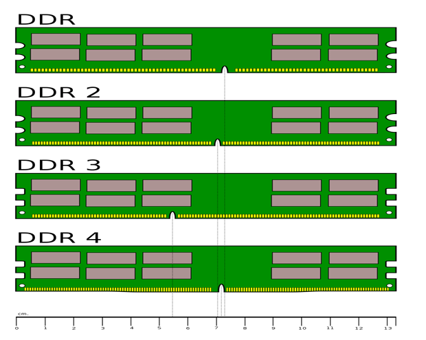
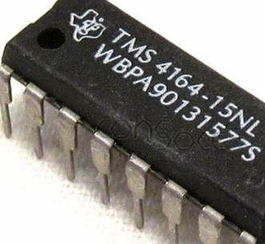
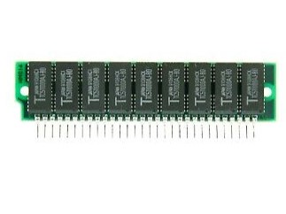
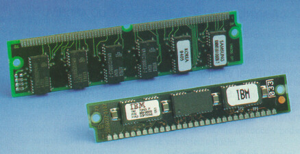
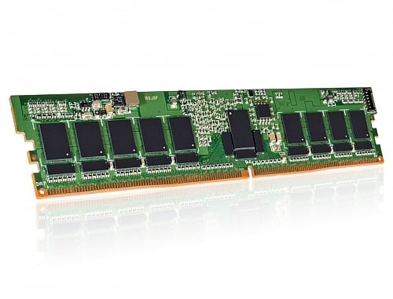
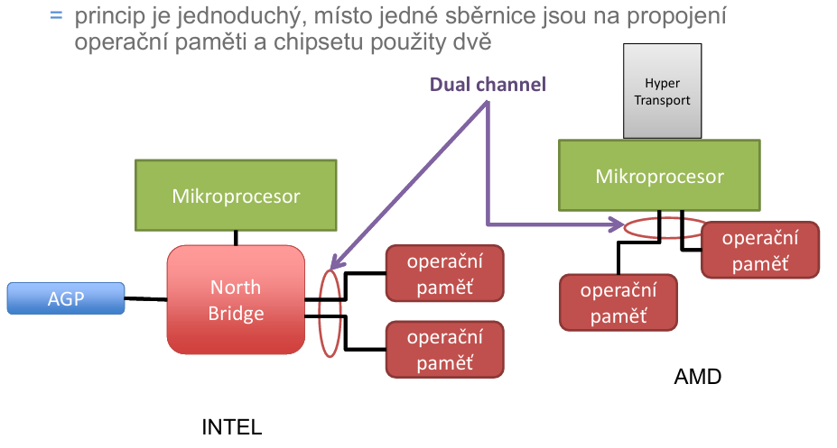
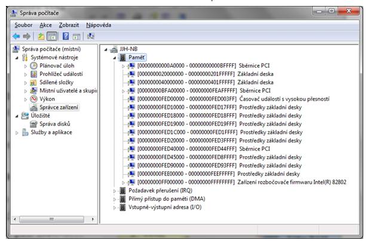
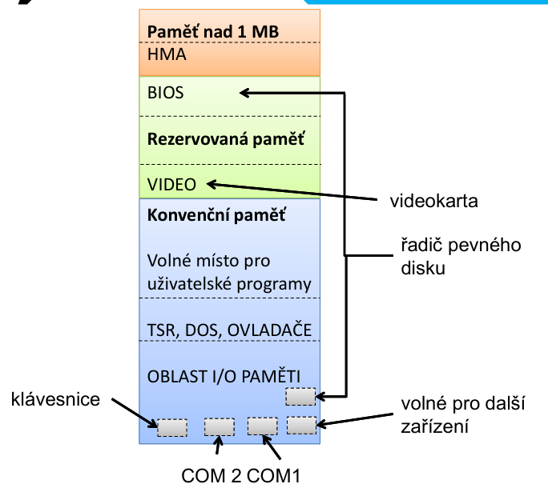

# Otázka č. 3 - Paměťová zařízení

Paměť je nutnost v počítači

procesor čte programy a ukládá své výsledky

Lze rozdělit na:
- Primární - pracuje s procesorem
- sekundární - odkládácí místo pro pragramy které teď nutně nepotřebujeme
## Parametry
- frekvence
- typ
- napětí
- datová propustnost
- vybavovací doba (ns)
- Kapacita paměti (KB,MB,GB,TB,PB, EB ZB, YB)
kilo, mega, giga, tera, peta, exa, zetta, yott
- energetická závislost - zda paměť uchává inforomace po odpojení zdroje

## princip paměti
- paměť = matice elektromagnetických prvků = paměťová buňka
- každá buňka nabívá hodnoty 1/0
- buňky jsou spojeny řádkovýmí a sloupcovými vodiči jimiž se zapisuje/čte

## ROM - read only memory
- polovodičová
- informace se neměmí a pouze se čtou

- ROM paměť není příliš rychlá řády 10ky ns a nastavení se načítá na RAM (shadowing)
- bývají využívány třebu u nastavení spotřebičů / starších konzolí i BIOS
- mají malou kapacitu
- zastaralá

### PROM - programmable read only memory
u PROM se data nahrávají až po výrobě paměti
používají se  k tomu tavné pojistky které je při naprogramování možné přepálit pomocí většího napětí

### EPROM - erasable programmable read only memory
mazání pomocí UV světla
speciální unipolární tranzistor -> Hradlo FAMOS
mazání postupně degraduje paměť
zapsání už funguje pomocí napětí které mění nastavení hradla

### EEPROM - Electrically Erasable Programmable Read Only Memory
elektronické mazání paměti
vylepšení hradla FAMOS
počet přepsání je ale stále omezen

### FLASH paměť
- vychází z EEPROM
- název Flash vychází z rychlosti oproti předchozím modelům
- SSD, USB, paměťová karta, paměť u telefonů, foťáků i MP3
- mazání se děje po **blocích**
## RAM - random access memory
- paměť pracující nejčastěji s procesorem
- polovodičové paměti které jsou energetický závislé a po vypnutí počítače se paměť ztratí
- Rychlejší a vyšší kapacita

### SRAM - statická RAM
- bistabilní klopný obvod - náročný, nákladný a nízká kapacita v kB max pár MB
- jedna paměťová buňka potřebuje více tranzistorů klidně 4 i 6 (označovali se 4-T / 6-T)
- využívá se tedy jako paměť registru, cache
- výhoda SRAM je rychlost přístupové doby v jednotkách ns
- také je energeticky úsporná
### DRAM - dynamická RAM
- paměťová Buňka je tvořena MOS tranzistorem a kondezátorem
- jestli je kondenzátor nabitý určuje informaci buňky -> nabitá 1/vybitá 0
- kondík se neustále vybijí a je nutné ho obnovovat (refresh paměti)
- oproti SRAM je výrazně levnější s mnohem větší kapacitou dnes už v GB
- přístupová doba je větší (desítky ns)
- spotřeba je taky vyšší
- využívá se jako operační paměť, paměť GPU
---
- Asynchroní DRAM 
    - nevyužívá systémové hodiny
    - je **velmi** jednoduchá
    - udává se maximální doba zapísu a čtení
- Synchroní DRAM
    - pracuje synchroně s procesorem pomocí hodinového signálu
    - složitější a *samostatnější* např. si sama řídí refresh
    - taktovací frekvence    
- DDR SDRAM - double data rate SDRAM
    - dvojnásobná rychlost - data se přenášejí při náběžné hraně tak při sestupné tedy 2 operaci za 1 takt

    | Frekvence | Napětí | Datová propustnost | Kapacita |
    |-----------|--------|--------------------|----------|
    |400MHz     |2.5V    |3.2 GB/s            |64 MB-2 GB|

    
- DDR2
    - dvakrát rychlejší než minulá generace
    - např. jádro 200MHz tak DDR pracuje na 400MHz a DDR2 na 800MHz
    - DDR2 nejsou zpětně kompatibilní s DDR

    | Frekvence | Napětí | Datová propustnost | Kapacita |
    |-----------|--------|--------------------|----------|
    |1066MHz    |1.8V    |8.5 GB/s            |8 GB      |
    
- DDR3
    | Frekvence | Napětí | Datová propustnost | Kapacita |
    |-----------|--------|--------------------|----------|
    |1600MHz    |1.4V    |12.8 GB/s           |16 GB     |
- DDR4
    | Frekvence | Napětí | Datová propustnost | Kapacita |
    |-----------|--------|--------------------|----------|
    |6400MHz    |1.2V    |40.6 GB/s           |128 GB    |
- DDR5
    | Frekvence | Napětí | Datová propustnost | Kapacita |
    |-----------|--------|--------------------|----------|
    |8200MHz    |1.1V    |37.5-64 GB/s        |256 GB    |

ochrana pamětí pomocí rýhy
    

- CMOS - RAM
    - malá spotřeba
    - pro zápis BIOS programem SETUP
    - je napájena baterií v zákl. desce po vypnutí PC
    - integrované hodiny reálného času

## RAM moduly
- DIP - Dual In-line Package - 16-18 pinů připájeny na pevno
    

---
- SIPP - Single In-Line Pin Package - 30 pinů velmi křehkých
    

---
- SIMM - Single In-line Memory Module - 32bit modernější připomíná dnešní + více kontaktů
    

---
- DIMM  - Dual In-line Memory Module - 64bit odděleny plošky na stranách modulu + varianty (SO-DIMM/MICRO)

---
- DDR dual channel (zapojení dvou pamětí)

---

## Logická organizace paměti

paměť využívají
- aplikace
- operační systém
- bios + HW zařízení
- I/O zařízení
- apod.

logická organizace paměti = pravidla přidělování paměti

(popis od IBM který je zastaralý ale princip je podobná a je to z prezentace tak by to mohlo být ok)

### Paměť je rozdělena na několik částí:
- Hlavní části:
    - konvenční paměť 
        - 0 - 640KB
        - určeno pro programy => vstupně/výstupní část
        
        - Programovatelná část
            - významná pro 16bit OS ale ne už pro 32bit
            - rezervovány adresy od 1KB a končí 640KB
            - lze najít ovladače
            - ve windowns se načítají pomocí registrů
        - IO paměť
            - rezervován první KB
            - každá část PC má vlastní adresu přes nichž může pracovat s procesorem
            - adresy mají také pravidla a rozlišují se tím díly desky(000-0FF)/rozšíření desky(100-3FF)
            - 2 zařízení nemohou mít stejnou adresu

        
    - rezervovaná paměť
        - rezervovány adresy 640KB-1MB
        - A0000 - C7FFF - grafický adaptér
        - F0000 - FFFFF - sysémový BIOS
        - pro technické prostředky počítače

        
    - paměť nad 1MB
        - nutný paměťový manažer
            - stránkové (EMM a EMS)
                - přepínač posílá stránkovanou paměť na adresy
            - nestránkové (XMM a XMS)
                - větší sběrnice = více adres
                - není tedy potřeba přepínač

    